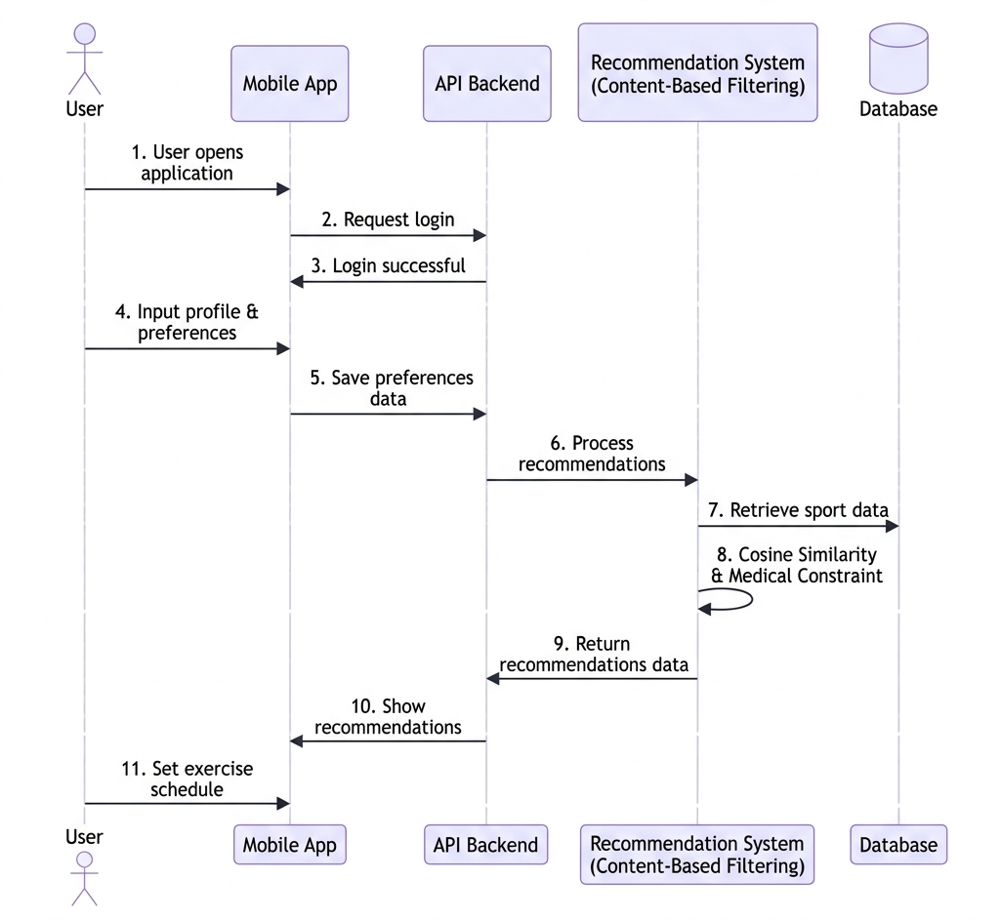
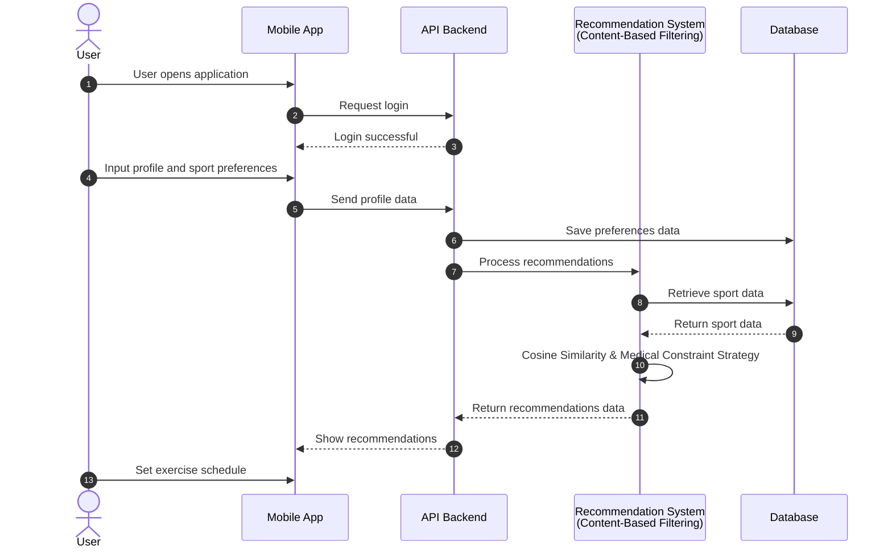

# Sequence Diagram - Sistem Rekomendasi Olahraga

Berikut adalah **Sequence Diagram** versi simpel & ringkas (hanya judul singkat) untuk Sistem Rekomendasi Olahraga.

## 🖼️ Visual Sequence Diagram

---

## 📊 Kode Diagram (Mermaid UML)

